## 컴퓨터 구조 - 2주차

### 2. 현대 컴퓨터 발전의 지표

- 고정결선식 프로그램 컴퓨터
  - 미리 정의된 기능을 물리적인 하드웨어로 설계한 기계
  - 스위치 조작이나 배선 연결 변경으로 프로그래밍(애니악)
- 앨런 튜링의 튜링머신
  - 무한한 길이의 테이프(tape)에 기호가 쓰여 있고, 테이프 위에 입출력 헤드(head)가 기호를 읽거나 쓸 수 있으며, 현재의 상태를 기록하는 상태기록기(state register)가 특정 상태에서 특정 기호를 읽었을 때의 행동을 정의한 작동 규칙표(action table)에 따라 상태를 변경하는 가상의 기계
    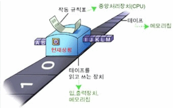
- 폰노이만 아키텍쳐( = 프린스턴 아키텍처)
  - 프로그램 내장식 컴퓨터(Stored-Program Computer)
    - 명령어와 데이터를 **내부 메모리에 저장**하고 순차적으로 CPU에서 해석하여 실행
    - 소프트웨어 개념 등장: 메모리의 프로그램을 변경하여 다양한 기능을 처리할 수 있음
    - 폰노이만 병목: CPU와 메모리 사이의 트래픽이 성능 지연에 영향을 미치는 현상
      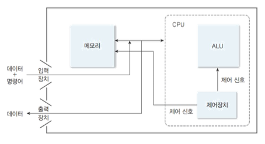
      범용성 = 하나의 하드웨어에서 여러 소프트웨어를 교체하면서 실행할 수 있어야 함
      [https://m.blog.naver.com/with_msip/221981730449](https://m.blog.naver.com/with_msip/221981730449)

### 3. 컴퓨터의 성능

- 성능의 정의
  컴퓨터의 성능 = 실행 속도
  - 실행 속도 = 응답시간(response time)과 처리율
  - 개인 사용자 입장 : 응답시간(response time), 실행 시간(execution time)
  - 시스템 관리자 입장: 처리율(throughput), 대역폭(bandwidth)
  - 시분할 시스템(time sharing system)의 경우, 정확한 응답시간을 측정하기 어려움
  - 입출력 장치를 사용하는 경우, 실행 과정에 많은 delay 발생
    CPU 실행 시간(execution time)
  - 프로그램을 수행하는 데 순수하게 사용된 시간
  - 입출력이나 다른 프로그램의 실행 시간은 포함하지 않음
  - 성능 = 1 / CPU 실행 시간
- 두 컴퓨터 M1과 M2의 성능 비교
  - 컴퓨터 𝑀2는 컴퓨터 𝑀1보다 성능이 𝑛배 좋다.
    = 컴퓨터 𝑀1에 대해 컴퓨터 𝑀2의 성능향상은 𝑛이다.
    = 컴퓨터 𝑀1에 대해 컴퓨터 𝑀2의 성능 비율(performance ratio)은 𝑛이다.
    
- [암달의 법칙(Laws of Gene Amdhal)](https://namu.wiki/w/%EC%95%94%EB%8B%AC%EC%9D%98%20%EB%B2%95%EC%B9%99)
  - 시스템의 일부분을 개선할 때 전체 시스템 성능이 얼마나 향상되는지 계산하는 방법
    - 병렬화에 의한 시스템 성능 향상의 한계를 지적하는데 사용
    - 병렬화에 의한 성능향상은 시스템의 순차적인 부분에 필요한 시간으로 제한된다
    - 즉, 시스템의 일부 기능을 향상시켜도 성능 향상이 되지 않는 부분에 의해 전체 시스템의 성능이 제한된다
- 암달의 법칙 공식
  - 시스템의 일부분 𝑓를 병렬화 하여 성능을 𝑛배 향상시키고,
    나머지 부분 (1 − 𝑓)는 그대로 두었다고 가정하고,
    성능 향상 전의 기계를 𝑀1, 성능이 향상된 기계를 𝑀2라 하면
    시스템 전체 성능 향상 𝑠는
    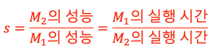
  - 𝑀1의 실행시간을 𝑚이라 할 때, 𝑀2의 실행시간은
    
  - 시스템 전체 성능 향상 𝑠는
    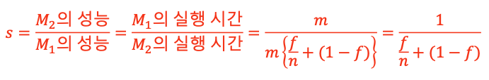
  - 이 때, 병렬화를 무한히 적용한다고 가정하면
    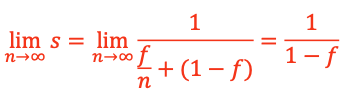
  - 결과적으로 시스템 전체 성능 향상 𝑠는 개선되지 않은 부분의 역수가 된다.
    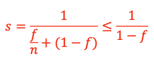
- ex)
  - 하나의 프로그램이 싱글코어 프로세서를 사용하면 20시간 소요
  - 1시간 부분은 병렬화할 수 없고, 나머지 19시간 부분은 병렬화 가능
  - 병렬화를 위한 프로세서의 수에는 제한이 없음
    시스템 전체 성능 향상은?
    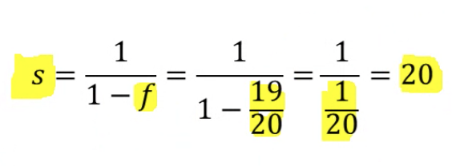
    19/20 = 95% 병렬화, 이 경우 성능 향상의 최댓값은 20%다
    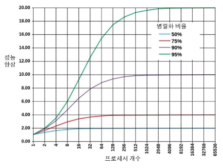

### 4. CPU 성능 분석

- 성능에 영향을 미치는 요소
  - CPU의 성능을 평가할 때 클록 속도(clock speed or clock cycle)가 중요!
  - 하지만, 클록 속도가 빠르다고 무조건 성능이 더 우수하다고 할 수는 없다
    동일한 CPU 구조라면 클록 속도가 3.0GHz인 CPU가 2.0GHz인 CPU보다 우수하지만, CPU 구조가 다르다면 클록 속도 이외의 다른 성능 요인도 살펴보아야 한다.
  - 헤르츠(Hz)
    - 주파수나 진동 수의 단위로 1초에 몇 번 진동하는가를 의미(정확한 시계의 초침은 1Hz)
    - 클록 속도 3.0GHz의 의미는 1초에 3G번(3,000,000,000번) 클록이 발생한다는 의미 → 한 사이클 당 시간 = 3G 분의 1초
  - 클럭이란?
    **[2) 클럭(동작 주파수)](https://library.gabia.com/contents/infrahosting/1227/)**
    과거, CPU의 성능을 높이는 가장 편리한 방법은 클럭(동작 주파수)를 올리는 것이었습니다. 하지만 클럭이 높아질수록 발열량과 소비 전력이 커지는 문제가 발생하였습니다. 따라서 최근에는 클럭을 일정 수준으로 유지하는 대신, ‘멀티 코어’나 ‘멀티 스레드’ 같은 방식으로 CPU 성능을 높이고 있습니다. 이를 통해 하나의 CPU로 동시에 처리할 수 있는 연산 개수를 늘려 연산 능력 향상을 꾀하는 것입니다.
    클럭(clock)이란 CPU의 속도를 나타내는 단위입니다. 클럭은 1초 동안 파장이 한 번 움직이는 시간을 의미하는데, 이 시간 동안 처리하는 데이터 양에 따라 CPU의 속도가 달라지게 됩니다.
- CPU 실행시간의 분해
  - CPU의 성능은 프로그램 실행 시간으로 구분 가능
    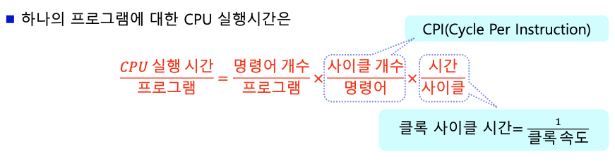
  - 따라서 CPU 실행 시간은
  - CPI는 명령어마다 다르므로 평균 CPI를 사용
    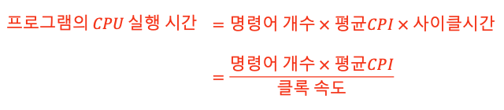
- 예제) 성능에 영향을 미치는 요소
  - 두 개의 컴퓨터 𝑀1과 𝑀2는 세가지 유형의 명령어 그룹이 있는데, 명령어 유형별 사용 빈도와 CPI는 다음 표와 같다.
    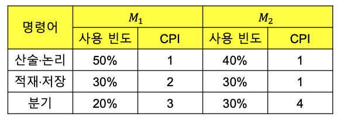
  - 컴퓨터 𝑀1, 𝑀2의 클록 속도는 각각 3GHz, 4GHz이다.
  - 두 컴퓨터에서 **동일한 개수의 동일한 명령어를 포함하는 특정 프로그램**을 수행할 때 어느 컴퓨터가 더 빨리 실행하는가?
    - M1의 평균 CPI = ~~2~~ 1.7(1x0.5 + 2x0.3 + 3x0.2), M2의 평균 CPI = ~~2~~ 1.9(1x0.4 + 1x0.3 + 4x0.3)
    - 1/3G, 1/4G → 1.7n/3G 1.9n/4G
      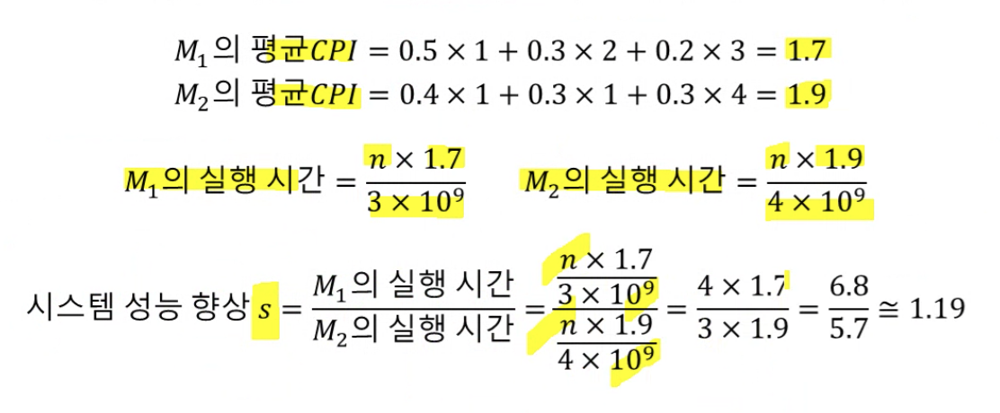
      실행 시간의 단위는 초(sec)
- 성능에 영향을 미치는 요소의 분석
  
  CPU의 실행시간을 줄이려면 → 분모를 키우거나 / 분자를 줄여야 함
  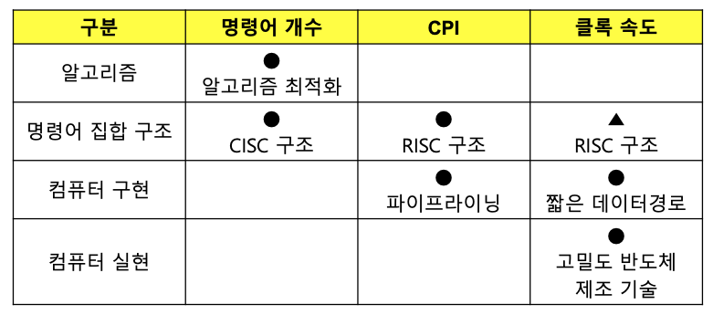
  - CISC(Complex Instruction Set Computer, 복합 명령어 집합 구조)
  - RISC(Reduced Instruction Set Computer, 축약 명령어 집합 구조)
  - 알고리즘 : 최적화된 알고리즘(명령어 개수 단축)
  - 명령어 집합 구조
    - 명령어 개수 : 프로그램 크기가 줄어듦(명령어 개수가 줄어듦)(CISC 구조)
    - CPI 향상 : RISC 구조가 평균 CPI와 사이클 시간을 줄일 수 있음
    - 클럭 속도 향상 : 명령어가 간단할 수록 유리함(RISC 구조 유리)
    - CPU 실행 시간 = 명령어 개수 x 평균 CPI / 클럭 속도 이므로 직접 값을 대입해보기 전까지는 어떤 구조가 유리한지 판별 못함
  - 컴퓨터 구현
    - CPI 향상 : 파이프라이닝(병렬화)
    - 클럭 속도 향상 : 짧은 데이터 경로
  - 컴퓨터 실현
    - 고밀도 반도체 제조 기술로 클럭 속도 물리적 향상
