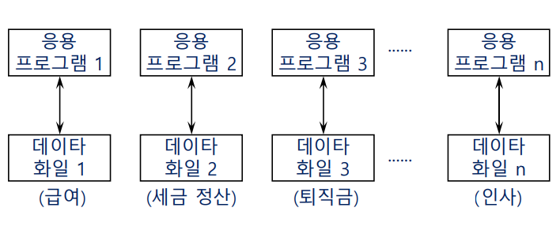
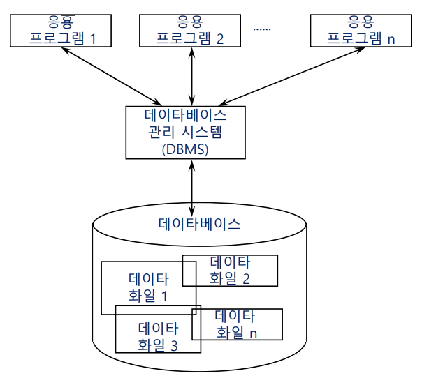

# 데이터베이스 개요

DBMS(DataBase Management System)의 발전 배경

초기 : 파일 중심 데이터 처리 시스템

- 각 응용 프로그램이 논리적 파일 구조를 정의하고 직접 물리적 파일 구조로 구현해야 함(파일 구조의 논리구조, 물리구조를 사용자가 모두 정의해야 함).
- 물리적 데이터 구조에 대한 접근 방법도 구현해야 함(ex.순차적 자료구조)
- 응용 간의 데이터 공용이 불가능(생산자 소비자 문제: 데이터 무결성 보장x. 해결방법: lock(세마포어) 상태 추가)
- 데이터의 종속성(dependency)과 중복성(redundancy)을 야기
  - 디스크 공간의 비효율, 데이터의 소실 가능성 상승 → 각 프로그램과 데이터 파일 간의 사용 방법(논리/물리 구조)이 다 달라지므로 종속됨(=재활용x)

이를 개선하고자 데이터를 다루는 공통된 함수(ex. open, read)를 이용해 공동으로 한 데이터에 접근할 수 있도록 함.

그러나 이 방식에도 한계가 존재했는데

- 여전히 데이터의 물리적 구조를 이해해야만 활용할 수 있음
- 데드락(교착 상태) 발생 가능성

그래서 최종 개선안은 DBMS의 형태를 띔

- DBMS(Database management system)이란?
  - 응용 프로그램과 데이터 사이의 **중재자**로서 모든 응용 프로그램(사용자)들이 데이터베이스를 공용할 수 있게 관리해 주는 범용 소프트웨어 시스템

DBMS는 세 가지 기능을 가지고 있음

1. **정의 기능**

- 하나의 저장 구조(storage structure)로 여러 사용자의 요구를 지원할 수 있도록 데이터를 조직(organize)하는 기능
- 정의 기능의 요건
  - 데이터의 논리적/물리적 구조(logica/physical structure)를 명세
        (ex. 학생은 학번, 학과, 이름으로 이루어져있다)
        (ex. 학번은 4byte, 학과는 8byte..로 구성돼있다)
  - 물리적/논리적 사상(mapping)을 명세(= 사용자는 논리적 구조만 알아도 사용할 수 있음)
        데이터를 위한 데이터 = 메타 데이터(매핑 정보, 논리/물리적 구조 정보)

        파일 시스템에서의 메타 데이터 = 파일/폴더 데이터가 어느 섹터에 위치해있는지에 관한 정보

2. **조작 기능**

- 사용자와 데이터베이스 간의 interface를 위한 수단

  검색(retrieve) / 갱신(update) / 삽입(insert) / 삭제(delete)

- 데이터 언어(query:SQL)로 표현됨
  - 사용하기가 쉽고 자연스러운 도구(인간 친화적)
  - 원하는 연산의 명세 가능
  - 효율적인 처리(response time이 짧을 수록)

3. **제어 기능**

- 데이터의 정확성(correctness)과 보안성(security)을 유지하는 기능
- 제어 기능의 요건
  - 무결성(integrity) 유지
  - 보안(security)
  - 권한(authority) 검사 : 접근자의 허용 접근 범위 확인
  - 병행수행 제어(concurrency control) : 여러 transaction들의 병렬적 수행 제어
  - 복구(recovery) : transaction의 consistency 유지 방안

DBMS의 장단점을 정리하자면 :

- 장점
  - 데이터 중복(redundancy)의 최소화
  - 데이터의 공용(sharing)
  - 일관성(consistency) 유지
  - 무결성(integrity) 유지
  - 보안(security) 보장 : 데이터를 암호화하여 보관
  - 표준화(standardization) 용이
  - 기관 전체 데이터 요구의 조정
- 단점
  - ~~운영비의 증대~~
  - ~~특정 응용 프로그램의 복잡화~~
  - ~~복잡한 백업과 회복(recovery)~~
  - ~~시스템의 취약성~~

인데, 사실상 단점은 모두 핸들 가능한 수준이라 단점이라 부르기 애매함.

DBMS의 궁극적 목적은 데이터 독립성(data independency)을 확보하는 것.

- 논리적 데이터 독립성(logical data independency)
  - 응용 프로그램에 영향을 주지 않고 논리적 데이터 구조의 변경이 가능
    ex. A 데이터가 I 데이터(이중전공)의 추가로 학과에서 본전공으로 변경되었을 때 → A 데이터를 보여주는 뷰를 참고하여 작성한 응용 프로그램은 수정하지 않아도 됨(메타 데이터만 수정하면 전혀 문제 없음)
  - 응용 프로그램의 효율적 개발이 가능
- 물리적 데이터 독립성(physical data independency)
  - 응용 프로그램과 논리적 데이터 구조에 영향을 주지 않고 물리적 데이터 구조의 변경이 가능
    (파일 중심 처리 시스템에선 물리적 구조의 변경이 응용 프로그램에도 영향을 미쳤음)
  - 저장 장치의 효율적 개발이 가능
