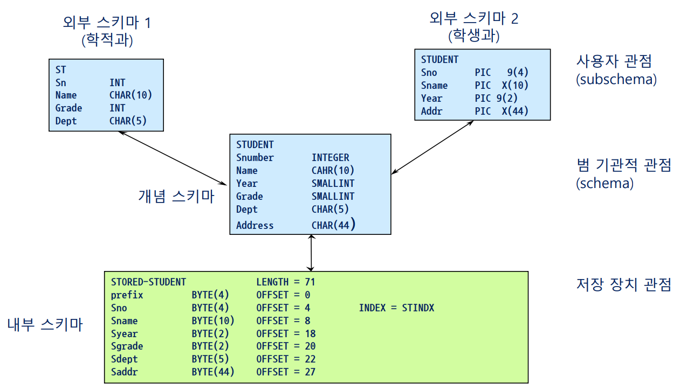
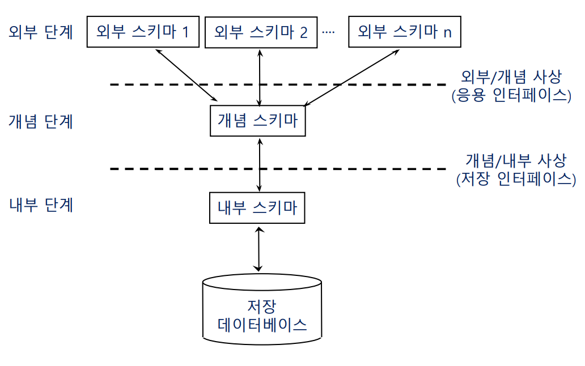
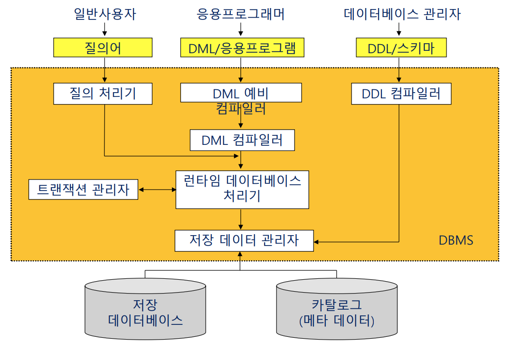
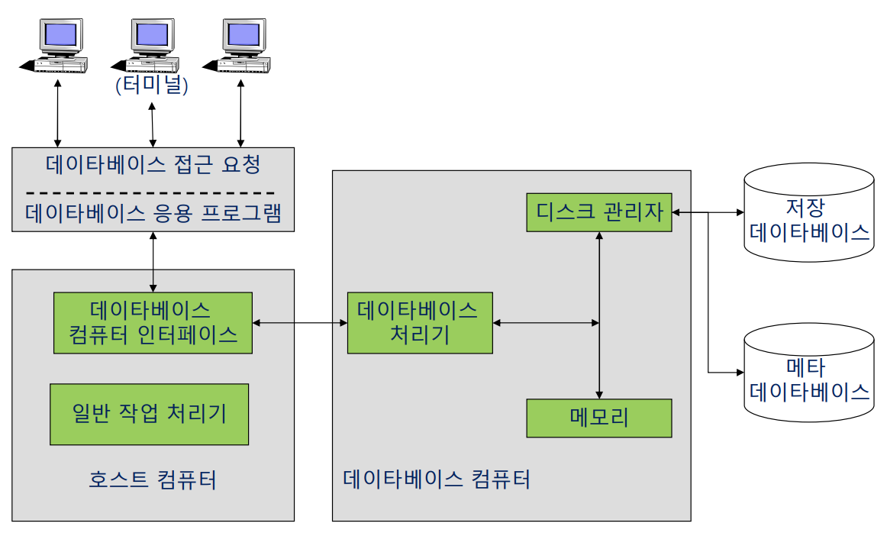
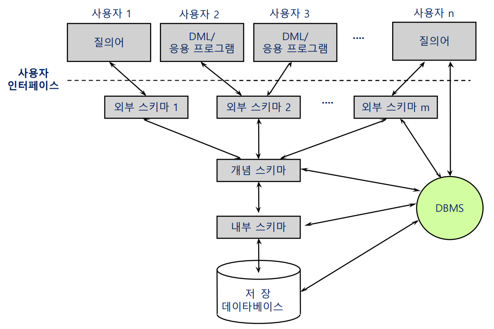

# 데이터베이스 시스템의 역사 및 구성

### 제1세대 DBMS : 절차적 명령

- IDS(Integrated Data Store)
  - 최초의 범용 DBMS
  - 네트워크 데이터 모델(graph)의 기초
- IMS(Information Management System) DBMS
  - 계층 데이터 모델(tree)의 기초
  - 1970년대 초에는 대형 컴퓨터 회사들이 DBMS를 자체 제작 판매

### 제2세대 DBMS : 비절차적 명령

- 관계 데이터 모델(relational data model)
  - Relational Database 이론의 기초
  - 1980년대 DBMS의 주류가 되었고 계속 확장
- SQL
  - IBM이 관계 DBMS의 일부로 개발
  - 세계 표준 데이타베이스 언어
- 주요 상용 DBMS
  - DB2, Oracle, Ingres, Sybase, Informix
- 오픈 소스
  - SQLite, MySQL, MariaDB, PostgreSQL
- PC 기반 DBMS
  - Access, FoxPro, dBase, Paradox, SQL Server

### 제3세대 DBMS

- 사용자의 데이터베이스 응용에 대한 복잡성(complexity) 증대
  - Engineering(e.g., CAD), images, videos, spatial(e.g., 지도 데이터), time series, data mining
- 사용자의 요구에 대처하기 위해 새로운 data model을 기반으로 시스템 개발
  - 객체지향 DBMS((OODBMS: Object-Oriented DBMS)
  - 객체지향 언어에 기반함
- 현재는 제2세대 DBMS + 제3세대 DBMS
  - 객체 관계 DBMS(ORDBMS: Object-Relational DBMS)

### 3단계 데이터베이스

기본 용어인 스키마를 먼저 알아야 한다.

스키마(schema) : DB의 구조(개체, 관계), 제약조건 명세

    e.g., 학년은 6학년까지, 성별은 3가지, 학과 기입 시 존재하는 학과여야 한다 등

다음은 3단계 DB의 구조.

- external schema(외부 스키마) : view, 개념 스키마의 일부를 보여줌
- conceptual schema(개념 스키마) : 논리적 스키마
- internal schema(내부 스키마) : 물리적 스키마

3단계 학생 데이터베이스 예시

3단계간의 사상(Mapping)

시스템 데이터베이스

- 카탈로그(catalog) = 데이터 딕셔너리 = 데이터 디렉토리
  - 시스템 내의 모든 객체들에 대한 정의(definition)나 명세(specification)에 대한 정보를 수록
  - 시스템 DB, 메타 데이타베이스(meta-database)
  - DB 관리자(DB Administrator)가 사용하는 도구
  - 사용자와 시스템 모두 사용
- 데이터 디렉토리
  - DB에 저장된 데이터를 참조(reference)하는데 필요한 정보를 수록
  - 시스템만 사용

DBMS 정리

- DBMS는 Database를 관리하고 사용자가 요구하는 모든 연산을 수행

  1. 사용자의 접근 요구(access request)를 접수/분석
  2. 시스템이 이해할 수 있는 형태로 사용자 요구를 변환(transform) : 비절차적 ↔ 절차적 명령
  3. 외부/개념/내부/저장 구조간의 사상(mapping)을 수행하여 저장 데이터를 접근
  4. 저장 DB에 대해 필요한 연산(operation)을 실행

  

  - 응용프로그래머 :
    e.g., 현금 인출 프로그램에서 데이터베이스를 접근할 수 있는 코드(host 언어 안에 들어가있는 임베디드 SQL)
  - 데이터베이스 관리자 : DDL 이용해서 스키마를 만듦

### 데이터 언어, 사용자, 하드웨어

- 데이터 정의어(DDL)
  - 데이타베이스 구조(Schema)를 정의(definitions)하고 변경(alteration)하는데 사용
  - 데이터 정의의 내용
    - 논리적 데이터 구조의 정의
      - 개념 스키마, 외부 스키마 명세
    - 물리적 데이터 구조의 정의
      - 내부 스키마 명세
      - 데이터 저장 정의어 (Data Storage Definition Language)
    - **논리적 데이터 구조와 물리적 데이터 구조 간의 사상을 정의**
- 절차적 데이터 조작어 vs. 비절차적 데이터 조작어

  - 절차적(procedual) DML
    - 저급 데이터 언어(low-level data language)
    - WHAT과 **HOW**를 명세
    - 한번에 하나의 레코드만 처리(one record at a time)
    - == Relational Algebra
  - 비절차적(non-procedual) DML
    - 고급 데이터 언어(high-level data language)
    - “**WHAT**” 만 명세(declarative)하고 “HOW”는 시스템에 위임
    - 한번에 여러 개의 레코드를 처리(set of records at a time)
    - == Relational Calculas(집합 연산자 : 합/교집합 등등)

- 데이터 부속어(DSL, Data Sublanguage)
  - Host program 속에 삽입되어 사용되는 DML
  - 비절차적 또는 절차적 DML(섞여있음, Input:비절차 Output:절차)
- 데이터 언어의 완전성(completeness of data language)

  - 사용자가 원하면 어떤 객체도 추출할 수 있고, 관계도 표현할 수 있는 능력

- 데이터 제어어(DCL:data control language)

  - 공용 데이타베이스 관리를 위해 데이타 제어(data control)를 정의하고 기술
  - 데이터 제어 내용
    - 데이터 보안(security)
    - 데이터 무결성(integrity)
    - 데이터 회복(recovery)
    - 병행수행(concurrency)
  - DB 관리 목적으로 DBA가 사용

- 사용자(Users)
  - 데이타베이스를 이용하기 위해 접근하는 사람
  - 일반 사용자(end user)
    - 비절차적 DML을 통해서 데이타베이스를 접근
    - menu, form, graphics
    - 데이터의 insertion, deletion, update, retrieval
  - 고급 사용자
    - 응용 프로그래머(application programmer)
      - 응용 프로그램(host 언어 + DML(DSL))을 통해서 DB를 접근
      - host 언어: PL/I, COBOL(레코드 다루기 용이), PASCAL, C, Java
    - DB 관리자 (DBA: database administrator)
      - DDL과 DCL을 통해 DB를 정의하고 제어하는 사람
  - 데이터베이스 관리자(DBA: Database Administrator)
    - DB 시스템의 관리, 운영에 대한 모든 책임을 지는 사람
    - DB 설계와 운영
      - DB의 구성요소(components)를 결정
      - 스키마 정의
      - 저장 구조와 접근 방법 설정
      - 보안 정책 수립, 권한부여, 유효성 검사
      - 백업(backup), 회복(recovery) 절차의 수립
      - DB의 무결성 유지
      - 성능 향상과 새로운 요구에 대응한 DB의 재구성
      - Catalog의 유지 관리
    - 행정 및 불평 해결
      - 데이터의 표현과 시스템의 문서화에 표준 설정
      - 사용자의 요구 및 불평 해결
    - 시스템 감시(monitoring) 및 성능 분석
      - 시스템 성능의 청취
      - 자원의 이용도, 병목현상(bottleneck), 장비 성능 등
      - 사용자 요구의 변화, 데이터 사용 추세, 각종 통계의 종합 분석
- 하드웨어 : 데이터베이스 컴퓨터
  - 대규모 Database (VLDB)
    - DB 규모의 대형화(e.g., PB(petabyte) : 1024TB ...)
  - DB 기능만을 효율적으로 수행하기 위한 특수 목적의 하드웨어
    - Backend computer(후위 컴퓨터)
    - 지능형 저장 장치
    - 내용식 메모리(associative memory)(e.g., map의 index에 들어가는 내용이 키(key)가 되어 키로 값을 바로 찾을 수 있게 하는 것)
    - 병렬 처리(parallel processing)
- 데이터베이스 컴퓨터 구성도
  
- 데이터베이스 시스템 구성도
  
  - 외부 스키마 뿐만 아니라 개념 스키마도 사용자가 사용할 수 있음(내부 스키마만 바로 사용x)
  - 독립성이 필요한 이유 : 각 단계 스키마가 변경될 가능성이 있어도 각 단위가 영향을 받지 않도록 해야 함
